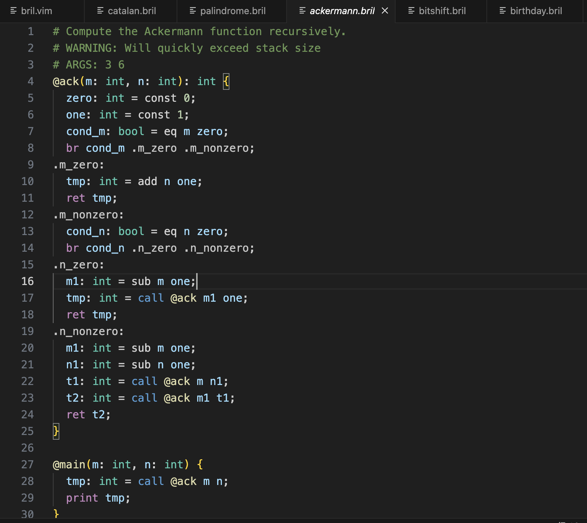

# bril-lang-hightlight README

[Bril](https://github.com/sampsyo/bril) is an intermediate language for teaching compilers. This is a syntax highting extension for Bril.

## Features

## Release Notes

### 0.0.1

Initial release of Bril-Syntax-highlighting extension
